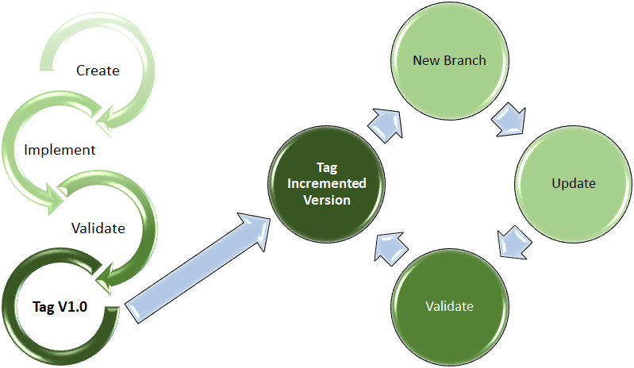

# Recommended SDLC for ServiceNow Custom Applications

*[Home](./README.md)*

## General Overview

This page describes the Software Development Lifecycle for custom applications developed for the ServiceNow platform.

A specialized SDLC is required so we can benefit from the supportability of apps developed on the unclassified network and to overcome the potential pitfalls of linking a ServiceNow application to a source control repository on the production network that can only be synchronized in one direction.

> Technical reasoning: Since it is not possible to create pull requests originating from classified networks, branches imported from the unclassified network must not be altered on the classified networks.  Therefore, any modifications required on the classified networks must be done in separate branches.

Following is a generalized overview of the software development lifecycle. Specific details will be provided, later.\

### General Unclassified Activities

1. Create new git repository or new branch from git repository of existing app.
2. Implement / modify ServiceNow application.
3. Test application as required.
4. Create repository tag indicating the new version. Revision number should be zero.

### General Activities for Classified networks

1. Import changes from unclassified repository and create new branch for changes applied from classified network.
2. Modify and/or configure application as necessary.
3. Test application on classified network.
4. Create repository tag with incremented revision number.
5. Deploy application to production instance.

> **Why separate branch on the high side?**
>Simply put, it logically separates changes made on the low side from changes performed on the high side. Once an application is imported into an instance of ServiceNow, it is highly recommended that the contents of that imported branch should never be modified outside of ServiceNow. The result of directly editing the contents of a ServiceNow application repository could be unpredictable. There can also be other unintended consequences if 2 different instances of ServiceNow are committing changes to the same branch of the same repository. By creating a separate branch, this allows us to freely make changes to the application on the high side, allowing us to roll back changes if needed. If a branch that is being used on the high side is accidentally modified on the low side (which is easy to do, and very hard to undo completely), it can be very difficult or even impossible to mitigate without data loss once we need to bring changes back into the high side. Branches which never exist on the low side can never be modified on the low side, even accidentally.
>
>To explain more technically, when changes from the low side are introduced into the high side, all conflicts must be resolved before it can be used. When ServiceNow saves changes to a repository, a new unique identifier is created in the repository database to represent that change. That unique identifier is also relative to the change that preceded it. ServiceNow stores that unique identifier and resolves any future changes by first referencing that unique identifier. A change in the repository on the low side results in a new unique identifier being created to represent the next sequential change as well. When you bring in the changes from the old side, you then have 2 unique identifiers, each claiming to be the successor of the same parent identifier, you must tell Git whether to use the ID that was created on the low side or the one created on the high side. If you pick the one from the high side, then changes from the low side are ignored. If you pick the one from the low side, then the unique identifier stored by ServiceNow no longer exists, and results in a protocol error when it tries to look up something that no longer exist (and ServiceNow wasn't tracking that it had been replaced). Your only option then is to uninstall and reinstall the entire application, possibly resulting in data loss. Even that may not work if the data from the previous application version still exists and the wrong upgrade script is applied to the existing data - because ServiceNow only knows the version that's being installed, and not the one that was being replaced.

## Versioning in ServiceNow and Git Repositories

This explains the standardized version numbering system that will be used to refer to specific application version. Each release of a ServiceNow application will be tagged with a unique, sequential version number. Typically, this starts with version 1.0 and is incremented with every release. The notation that is used to represent software versions follows the commonly used format which is comprised of 2 to 4 whole numbers separated by periods with each number representing major, minor, build and release versions:\
\
If the last 1 or 2 parts are omitted, it is assumed to be zero (ex. 2.5 is equivalent to 2.5.0 and 2.5.0.0). Applications on the low side should only use 2 or 3 number version notation. The revision portion is reserved for changes made on the high side.

### Repository Version Tags

A separate git repository tag is to be created with each release of a ServiceNow application created on the low side. The name of this tag will start with the letter 'V', followed by version number of the application itself.

### Repository Branches

In ServiceNow, you check out (install) a specific version of an application by selecting a specific repository branch. You can also create new branches starting from a specific version tag. The applications from the "master" branch should never be used in production. Likewise, branches which have been copied up from the low side should never be used in production. When installing an app in production you should do so from a new branch that is created either from a tag or from another branch.

**Meaning of version number parts:**

- Major: This number is usually 1 or greater (a value of 0 indicates a pre-production release). This number will be incremented after any change is made that makes the application incompatible with another application, process or integration target. This can also be incremented if the changes have a significant impact on user perception or behavior within the application as a whole. Perceptive changes to a single form do not usually qualify as a major change, but a major deviation in a workflow might. Any time this is incremented, minor, build and revision numbers are reset to zero.
- Minor: This number starts with zero with each major version change and is incremented with each set of changes that represents enhancements and/or bug fixes that do not qualify as a major version change. Any time this is changed, build and revision numbers are reset to zero.
- Build: This number gets incremented with each change that represents an alternation of the same application version. An example might be to provide a non-production version that has default values which are different than those on the application deployed in production. If this number is not provided, it is assumed to be zero (ie. V2.1 is equivalent V2.1.0).
- Revision: This number gets incremented any time a subsequent change is made on the high side that is not made on the low side. Typically this is for re-tweaking modifications that were made on the high side after initial deployment.

## Unclassified Network SDLC

> **Recommended Training**
> To understand how ServiceNow Applications work with Git repositories involved in the SDLC, you can do the "Create the NeedIt Application and Application Files" training module on the ServiceNow Developers website. To find this module, go to the [ServiceNow Developers website](https://developer.servicenow.com), the navigate to "Learn" ⇒ "Learning Plans" and open the "ServiceNow Administrator" plan. This module should be the first one that shows up. In that training module, you'll actually create an application and check it into a Git Repository.

### Initial Implementation

1. **Create**
   1. Create a new system application on the [Cloud Dev Instance](https://inscomscd.servicenowservices.com/).
   2. Create a new repository in the [USASOC-HQ GitHub Org](https://github.com/USASOC-HQ).
      - Use the application scope name as the repository name, which should start with `x_g_inte_`.
      - DO NOT initialize with README, .gitignore or licence.
   3. Link application with source control using the URL of the repository that was created.
   4. Ensure the master branch is not checked out. ServiceNow should have already created a separate branch for modifications.
2. **Implement**
   1. Perform initial design/implementation of application.
   2. Ensure changes are commit to source control.
3. **Validate**
   - Perform user acceptance testing, making further modifications as necessary.
4. **Tag V1.0**
   - The first version tag for the application will be `V1.0`.
   - At this point the application can be deployed to the production network. See the [Using Git with ServiceNow](./UsingGit.md) page for details on moving repositories into the disconnected classified environment.

### Subsequent Modifications

1. **New Branch**
   - Create a new branch from the preceding repository version tag.
   - A good practice for the branch naming is to start with the letter *'D'*, followed by the the next incremented version number, so it can be easily identified as a development branch as well as what the target version number would be.
2. **Update**
   - Change version number in ServiceNow application to reflect the new target version number.
   - Perform application modifications.
3. **Validate**
   - Perform user acceptance testing. Proceed to next step if passed; otherwise revert to #2.
4. **Tag Incremented Version**
   - Create release tag to match application version.
   - At this point the latest application version can be deployed to the production network. See the [Using Git with ServiceNow](./UsingGit.md) page for details on moving repositories into the disconnected classified environment.

## Classified Network SCLC

Wherever practical, and where there are no security concerns, changes should first be performed on the unclassified network.\

### Production Network Introduction

1. **Repository Merge**
   1. Merge changes from unclassified repository, overwriting any changes in the classified repository. The [Using Git with ServiceNow](./UsingGit.md) page provides more technical details for synchronizing production with development.
   2. Create new repository branch from the target version tag with the next incremented revision umber.
   3. The name of this branch should start with a *'P'* followed by the target application version *(ie. Tag `V1.0.0.0` ⇒ Branch `P1.0.0.1`)*. This makes it easily identifiable as a production branch.
   4. If there are no changes to be made on the high side, proceed to step #5
2. **Configure / Modify**
   1. Import application into ServiceNow high-side dev instance (or change branches if already installed) using the branch created in the previous step.
   2. Perform any changes that could not be done on the low side.
   3. Commit changes to repository.
3. **Validate**
   1. Check out branch in Test and/or UAT instances and conduct validation testing.
   2. If unsuccessful, revert to #2 or optionally revert to development cycle on low side.
4. **Revision Tag**
   1. Create version tag in repository for the next incremented revision number *(ie. Tag `V1.0.0.0` ⇒ Branch `P1.0.0.01` ⇒ Tag `V1.0.0.1`)*.
5. **Deploy**
   1. Check out branch in latest revision tag into production instance.
   2. Application studio should automatically create a separate branch for any modifications that might occur in production.

### Subsequent Classified Modifications

1. **New Branch**
   1. Create new repository branch for the new revision
   2. The name of this branch should start with a *'P'* followed by the target application version with its revision number incremented *(ie. Tag `P1.0.0.1` ⇒ Branch `P1.0.0.2`)*.
2. **Update**
   1. Perform application modification / reconfiguration.
      1. Commit changes to repository
3. **Validate**
   1. Check out branch in Test and/or UAT instances and conduct validation testing.
   2. If unsuccessful, revert to #2 or optionally revert to development cycle on low side.
4. **Revision Tag**
   1. Create version tag in repository for the next incremented revision number *(ie. Tag `V1.0.0.1` ⇒ Branch `P1.0.0.02` ⇒ Tag `V1.0.0.2`)*.
5. **Deploy**
   1. Check out branch in latest revision tag into production instance.
   2. Application studio should automatically create a separate branch for any modifications that might occur in production.

_____

*[Home](./README.md)*
