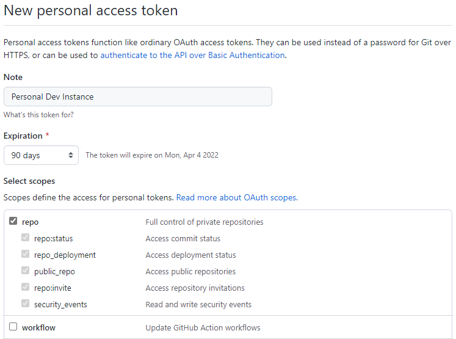
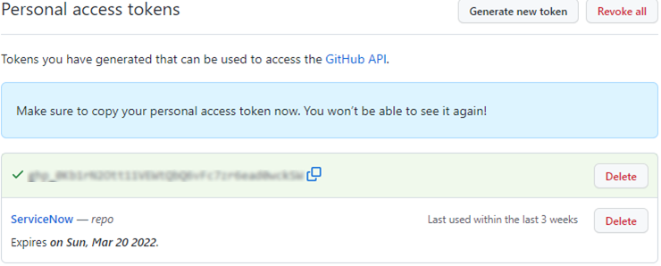

# Using Git with ServiceNow

## Shared Git Organization

A shared Git organization has been created and can be accessed at the [USASOC-HQ Git org website](https://github.com/USASOC-HQ). Names of repositories for custom ServiceNow apps will begin with `x_`. Names of all other repositories should begin with something other than that.

Following is a list of some of the custom applications that are stored in git repositories:

- x_g_inte_phys_net - Shared physical network definitions for pick lists, etc.
  - x_44813_phys_net_network - Legacy version of x_g_inte_phys_net.
- x_g_inte_usasoc_ia - USASOC Information Assurance app.
- x_g_inte_off_net_s - Off-Net Software License Tracking app.
- x_44813_usasoc_cst - General Legacy Customizations. To be superseded with a x_g_inte_* app once new production environment configuration has been determined.

## GitHub Authentication from ServiceNow

You will need to set up a personal developer token which you will use in ServiceNow to authenticate to GitHub. Log into GitHub and open your personal access token list from the developer settings as depicted:

Under the "Select Scopes" section, Select the "repo" group, and then click the "Generate Token" button at the bottom.

Your personal access token will be presented in the next screen. From within ServiceNow, you will configure a basic credential using  your GitHub login and the personal access token as the password.

In ServiceNow, you will create credentials as follows:

1. Navigate to Connections and Credentials => Credentials.
2. Click the "New" button and select "Basic Auth Credentials".
3. In the "User name" field, enter your GitHub login name.
4. In the "Password" field, enter the personal access token that was generated in GitHub.

## Unclass-to-Production Synchronization

This procedure has not yet been fully tested and is subject to further adjustment.

1. Create local bare clone of repository.
   Example: `$ git clone --bare --recursive https://github.com/USASOC-HQ/x_44813_phys_net_network`
2. Ensure target tag and branch has been fetched from the remote repository:
   1. List all tags to get the commit reference for the tag and to ensure the tag exists in the local repository.
      Example:
      <pre><code>$ git show-ref --tags
      393bc8fca9bd180b57db4342d92c10c67316d113 refs/tags/V1.0.0.0
      cafbf06e04c92145d814778a5366b58dd37ed9b2 refs/tags/V1.0.1.0</code></pre>
   2. Ensure a local branch exists which contains the target tag
      Example:
      <pre><code>$ git branch --contains 393bc8fca9bd180b57db4342d92c10c67316d113
      origin/sn_instances/inscomscd</code></pre>
3. Compress the contents of the entire repository folder into a ZIP file and copy it to the production network.
4. On the production network extract the repository and create a new branch from the target version tag. See the [Classified Network SDLC](./SDLC.md#classified-network-sclc) section of the SDLC page to determine the name of the new branch and for further instruction.

## Legacy Development Repositories

Previously, all ServiceNow application git repositories were initiated from a personal developer instance and are attributed to a specific person (registration #44813), and not to this organization. Applications and their repositories whose names use the prefix `x_44813_` should be re-created starting from the [Cloud Dev Instance](https://inscomscd.servicenowservices.com/), as outlined in this SDLC, as time permits. ServiceNow applications that have been created on the [Cloud Dev Instance](https://inscomscd.servicenowservices.com/) will be prefixed with `x_g_inte_`.

No operational risk is incurred simply because an application was initiated through a personal dev instance. Such applications are just treated the same as any other 3rd party application. This also means that only the individual developer who owned that personal dev instance can make direct changes to that application without experiencing minor semantic complications. Another benefit of initiating apps from the cloud instance is that they are less prone to permissions and trust issues.
